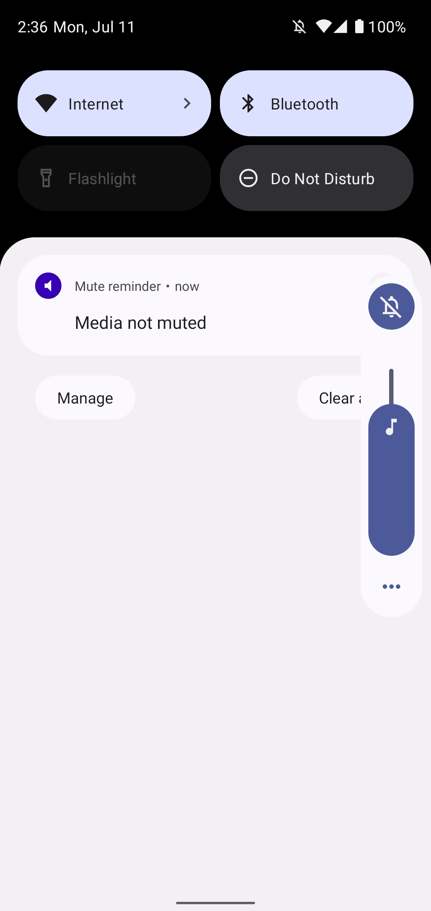

# Mute Reminder

A notification is shown if ringtone is muted, but media isn't and media would be played over local speakers.

<!-- 

 -->

## Translations

App strings and the app store description can be translated via Crowdin: https://crowdin.com/project/mutereminder

Translations have to be approved before being merged into the app. To become a translator with approval rights or to request a new language, please [poke me on Crowdin](https://crowdin.com/profile/mueller-ma) or open an issue here on GitHub.

## Credits

* Feature graphic by https://unsplash.com/@mbaumi
